  
  

    
    
    
  

  
  <h1>
    hey there
    
  </h1>

  

---

### 👨‍💻 About Me :
I am a Frontend Developer  from Armenia.
- :telescope: I’m working as a Software Engineer and contributing to frontend for building web applications.

- :seedling: Exploring Technical Content Writing.

- :zap: In my free time, I solve problems on GeeksforGeeks and read tech articles.

- 📭 How to reach me: 

---

### 🛠️ Languages and Tools :

  &nbsp;
  &nbsp;
  &nbsp;
  &nbsp;
  &nbsp;
  &nbsp;
  &nbsp;
  &nbsp;
  &nbsp;
  &nbsp;
  &nbsp;
  &nbsp;
  &nbsp;
  

---

---

### 🔥 My Stats :

